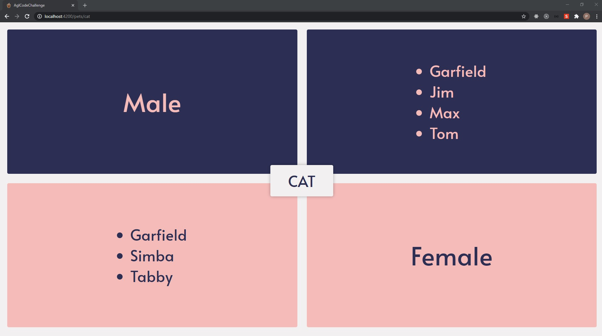
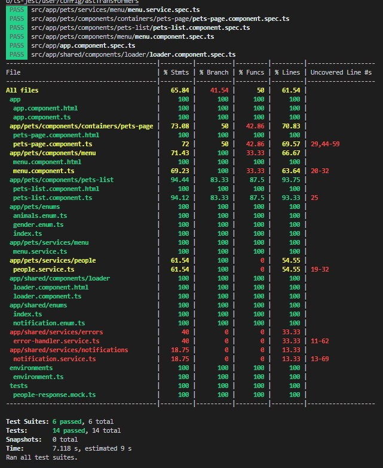
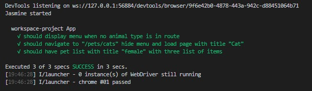

# AglCodeChallenge



## Intro

This coding challenge was built using Angular v10 and the Angular CLI. The project demonstrates Angular best practices. The development has been time boxed, while this limitation prevented the demonstration of advanced concepts such as PWA's, service worker and NGRX it is still engineered to demonstration the many benefits of using Angular and its feature.

[How to](#How-to)

[Angular Best Practices](#Angular-Best-Practices)

[Tests](#Tests)

## How to

```bash
# Install dependencies
npm install

# Run application
npm start

# Run unit tests
npm test

# Run e2e test
npm run test:e2e

```

## Angular Best Practices

Below are a few Angular best practices that have been implement that I would like to highlight. There are many more which can be found matched against the official list. https://angular.io/guide/styleguide

### Feature module

- Separated related features into Angular modules (PetsModule, SharedModule)

### Performance

- Use of OnPush change detection strategy to limit needless renders
- Lazy loading modules to increase init page load and reduce page weight

### Services

- Use of the provideIn: root
- Single responsibility
- Talk to the server through a service

### Reusability

- Built reusable components
- Singleton Services to be shared (MenuService, PeopleService)

### Application structure and NgModules

- LIFT
- T-DRY
- Folders-by-feature structure

## Tests

Coverage reports will be generated when running `npm test` and can be found under the folder `coverage/`

```bash
# Run unit tests
npm test

# Run e2e test
npm run test:e2e

```

### Unit Tests



### e2e Tests


